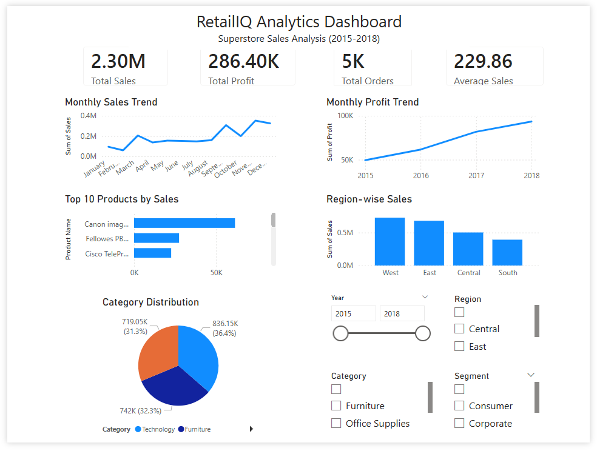

# RetailIQ Analytics 📊

## Dashboard Preview



A professional Data Analytics project built using Python and Power BI to analyze Superstore sales data and generate business insights.


## 🚀 Project Overview

RetailIQ Analytics provides insights into:

* Sales Trends
* Profit Analysis
* Product Performance
* Regional Performance
* Customer Segments
* Shipping Analysis


## 🛠 Technologies Used

* Python
* Pandas
* NumPy
* Matplotlib
* Seaborn
* Power BI
* Jupyter Notebook


## 📂 Project Structure

```
RetailIQ_Analytics/
│
├── data/
│      ├── raw/
│      └── processed/
│
├── notebooks/
│      01_data_loading.ipynb
│      02_data_cleaning.ipynb
│      03_exploratory_data_analysis.ipynb
│      04_visualization.ipynb
│      05_business_insights.ipynb
│
├── scripts/
├── charts/
├── reports/
├── docs/
├── powerbi/
├── sql/
├── config/
├── src/
│
├── main.py
├── requirements.txt
├── README.md
└── .gitignore
```


## ✨ Features

✔ Data Cleaning

✔ Exploratory Data Analysis

✔ Data Visualization

✔ Automated Business Insights

✔ Chart Generation

✔ Text Report Generation

✔ Power BI Dashboard

✔ Modular Python Scripts


## 📈 Dashboard KPIs

* Total Sales
* Total Profit
* Total Orders
* Average Sales


## 📊 Visualizations

* Monthly Sales Trend
* Monthly Profit Trend
* Top Products by Sales
* Region-wise Sales
* Category Distribution


## ▶️ Run Project

Clone repository:

```bash
git clone https://github.com/mahi-tech-dev/RetailIQ-Analytics.git
```

Go inside project:

```bash
cd RetailIQ-Analytics
```

Install dependencies:

```bash
pip install -r requirements.txt
```

Run:

```bash
python main.py
```


## 🔮 Future Enhancements

* SQL Integration
* Streamlit Dashboard
* Machine Learning Models
* Sales Forecasting
* Customer Segmentation
* Deployment


## 👨‍💻 Author

**Mahesh Ugale**

GitHub:
https://github.com/mahi-tech-dev

---

⭐ If you found this project useful, consider giving it a star.
